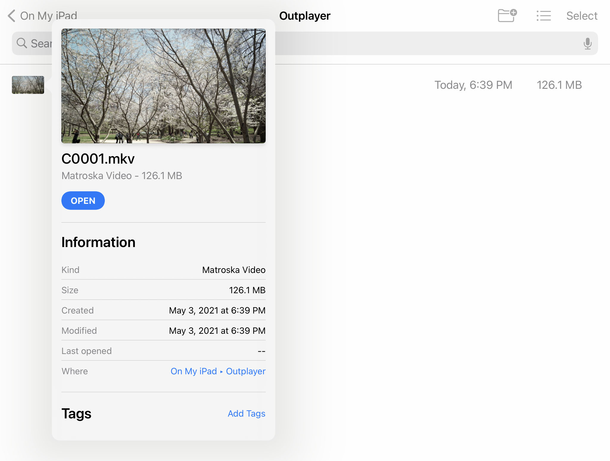

# VideoThumbnailing

This is an experiment in using FFmpeg for an iOS Thumbnail Extension, with the `QuickLookThumbnailing` framework, to show thumbnails in the Files app for non-native video files.

## Background

### Thumbnail Extension

As of iOS 14, Thumbnail Extensions have a memory usage limit of just 50 MB. If you exceed that, the extension will be terminated with `EXC_RESOURCE`.

When viewing a directory in the Files app, iOS will concurrently call `provideThumbnailForFileRequest:completionHandler:` for every file your extension is registered for. If it's terminated, the rest of the thumbnail requests get cancelled (though it seems the extension will restart when you view a different directory).

### FFmpeg

To pull a static frame from a video, this uses a standard demux and decode flow with `libavformat` and `libavcodec`. Then using `libswscale` the frame is rescaled to the requested size, that gets drawn in the Core Graphics context, and in the end it displays as expected!

## Problems

Concurrent calls to `provideThumbnailForFileRequest:completionHandler:` make it easy to have too many threads running at once, and with FFmpeg's memory usage even 2 or more threads may be too much for the 50 MB limit.

The concurrency can be avoided by wrapping everything in `@synchronized` to block the threads, which allows it to work... sometimes.

Even with a single thread, FFmpeg can easily use more than 50 MB for some of the demux or decode steps, especially for larger files. In real use cases, this extension can get terminated quite often, which leaves some or all thumbnails missing.
